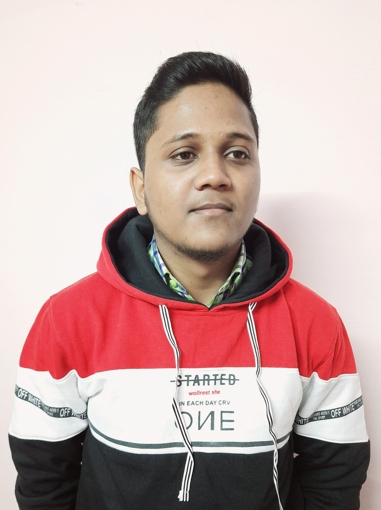

# SHOBHIT CHAUHAN
 

---

Hello! My name is Shobhit Chauhan.I am from Manakapur, Gonda, Uttar Pradesh (U.P).  
Currently, I am pursuing B.Tech form a renowned institute Indian institute of Technology, Goa.  
My hobbies are coding and exploring new ideas.  
I have keen interest in Electronics.  
## EDUCATION
---
## 1st-Year Courses@IIT Goa
### Autumn Semester
- CS101:Introduction to Computing by Dr.Clint P. George  
- CH101:Physical Chemistry by Mantu Santra  
- CH102:Inorganic Chemistry by Dr.Raja Mitra
- HS101:Humanities and Social Scienes by Dr. Sabiha Hashami  
  
  
### Spring Semester
- CS102:Introduction to Software Tools by Dr.Clint P. George link:[ Click Here! ](https://clintpgeorge.github.io/cs-101/autumn-2021/ "Course WebPage")
- PH102:Electricity and Magnetism by Vaibhav Wasnik
- MTH1021:Calculus by Dr.Kalpesh Haria
- BIO101:Introductory Biology by Dr.Sreenath Balakrishnan

---

## Hobbies
My hobby is coding. Some examples are as follows.

```python

print('Hello, world!')

```

```C++
// Your First C++ Program

#include <iostream>

int main() {
    std::cout << "Hello World!";
    return 0;
}

```